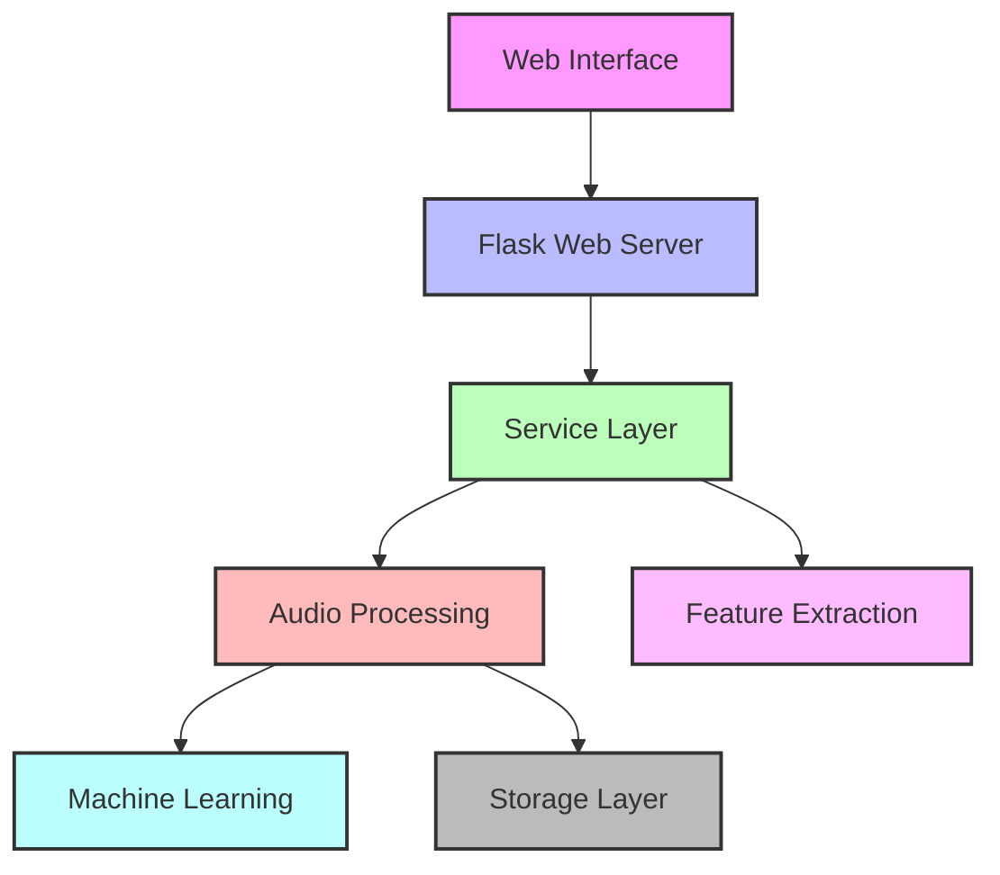

# SoundsEasy Developer Onboarding

Welcome to the SoundsEasy project! This guide will help you get started quickly with the codebase.

## Quick Start

1. **Clone the repository**
   ```bash
   git clone https://github.com/yourusername/SoundClassifier_v09.git
   cd SoundClassifier_v09
   ```

2. **Set up your environment**
   ```bash
   python -m venv venv
   source venv/bin/activate  # On Windows: venv\Scripts\activate
   pip install -r requirements.txt
   ```

3. **Run the application**
   ```bash
   python main.py
   ```

4. **Access the web interface**
   Open your browser and navigate to `http://localhost:5000`

## Project Structure At-a-Glance

```
SoundClassifier_v09/
├── backend/            # Core backend functionality 
├── src/                # Web application and services
│   ├── ml/             # Machine learning components
│   ├── services/       # Service layer
│   ├── templates/      # HTML templates
│   └── static/         # Static assets
├── tools/              # Utility scripts
├── legacy/             # Legacy code (for reference)
├── main.py             # Application entry point
└── config.py           # Configuration
```

## Key Components

### 1. Web Application (Flask)

The web interface is built with Flask and provides:
- User authentication
- Sound recording and verification
- Model training and inference
- Dictionary management

**Start Here:** `main.py` contains the main Flask application and routes.

### 2. Audio Processing Pipeline

The audio processing pipeline handles:
- Recording audio from the browser
- Segmenting audio into individual sounds
- Extracting features for machine learning
- Training and inference with ML models

**Start Here:** `src/services/recording_service.py` is the entry point for the new unified audio processing.

### 3. Feature Extraction

The feature extraction system:
- Extracts acoustic features from audio
- Implements caching for performance
- Provides consistent features across training and inference

**Start Here:** `backend/features/extractor.py` contains the unified feature extractor.

### 4. Machine Learning

The machine learning components include:
- Feature extraction and preprocessing
- Model training and cross-validation
- Inference and prediction

**Start Here:** `src/ml/inference.py` shows how the ML models are used for prediction.

## Common Tasks

### Adding a New Feature

1. Consider which layer the feature belongs in (backend, service, web interface)
2. Follow the existing patterns in similar files
3. Make sure to add tests for your new feature
4. Update documentation to reflect the new feature

### Fixing a Bug

1. Identify the affected component(s)
2. Add tests to reproduce the bug
3. Fix the bug
4. Run tests to ensure the fix works
5. Update documentation if necessary

### Modifying Audio Processing

1. Start with `src/services/recording_service.py`
2. Ensure any changes maintain compatibility with both recording and training
3. Test with real audio to verify the changes work as expected

### Working with the Feature Extractor

1. The `FeatureExtractor` class is the single source of truth for feature extraction
2. Check `backend/features/extractor.py` for the implementation
3. Use the caching functionality for performance
4. Ensure consistency between training and inference

## Best Practices

1. **Follow the Unified Approach**
   - Use the unified `FeatureExtractor` for all feature extraction
   - Use the `RecordingService` for audio processing
   - Follow the established directory structure for new code

2. **Maintain Backward Compatibility**
   - Support both unified and legacy approaches where needed
   - Test changes with both approaches
   - Document any breaking changes

3. **Write Tests**
   - Add tests for new functionality
   - Run existing tests before submitting changes
   - Verify audio processing changes with real audio

4. **Update Documentation**
   - Add docstrings to new functions and classes
   - Update README.md and other documentation when making significant changes
   - Keep API documentation up to date

## Recent Changes

The project is undergoing a transition to a more unified, maintainable architecture. Key recent changes include:

1. **Unified Feature Extraction**
   - Consolidated feature extraction into a single implementation
   - Added caching for performance improvement
   - Ensured consistency between training and inference

2. **RecordingService Implementation**
   - Unified audio processing through a service layer
   - Consistent processing across recording, verification, and training
   - Improved metadata handling

For more detailed information about these changes, see `RECENT_CHANGES`.

## Getting Help

If you have questions or need assistance:

1. Check the documentation in the codebase
2. Refer to `README.md` and `RECENT_CHANGES.md`
3. Look at existing code for examples
4. Reach out to the team for support

Happy coding!


# SoundsEasy Sound Classification System

## Overview

SoundsEasy is a comprehensive web application for recording, processing, classifying, and managing sound samples. The system combines a user-friendly web interface with advanced machine learning capabilities to enable training custom sound classification models and performing real-time sound detection.

### System Architecture Diagram

The architecture follows a layered approach with clear separation of concerns:



If your Markdown viewer doesn't support Mermaid diagrams, here's a text representation:

```
+---------------------+
|    Web Interface    |
+----------+----------+
           |
+----------v----------+
|   Flask Web Server  |
+----------+----------+
           |
+----------v----------+       +-------------------+
|  Service Layer      |------>| Feature Extraction |
| (RecordingService)  |       +-------------------+
+----------+----------+
           |
+----------v----------+       +-------------------+
| Audio Processing    |------>|  Machine Learning  |
+----------+----------+       +-------------------+
           |
+----------v----------+
|  Storage Layer      |
+---------------------+
```

### Key Features

- **Sound Recording**: Record sound samples through a web interface
- **Sound Processing**: Segment, clean, and extract features from audio
- **Sound Classification**: Train machine learning models to classify sounds
- **Sound Detection**: Real-time detection of sounds using trained models
- **User Management**: User authentication and authorization
- **Sound Management**: Organize, verify, and manage sound samples
- **Dictionary System**: Group related sound classes into dictionaries
- **API Interface**: RESTful API for programmatic access to the system

## System Architecture

The application follows a modular design with several key components:

### Frontend
- Web interface built with HTML, CSS, JavaScript, and Bootstrap
- Interactive recording and verification interfaces
- Sound visualization and playback

### Backend
- Flask web server handling HTTP requests and responses
- RESTful API endpoints for various operations
- Authentication and authorization
- File management for sound samples

### Data Processing Pipeline
- Audio recording and conversion
- Sound segmentation and feature extraction
- Feature normalization and preprocessing
- Model training and inference

### Machine Learning
- Feature extraction using various audio feature sets (MFCC, spectral features, etc.)
- Support for multiple classifier types (Random Forest, Ensemble, etc.)
- Model training, testing, and evaluation
- Inference engine for real-time sound detection

### Storage
- File-based storage for sound samples
- JSON-based metadata storage
- Feature cache for improved performance

## Transitional Changes

The codebase is undergoing a significant transition to improve performance, maintainability, and extensibility. The main focus has been unifying the feature extraction process and implementing a consistent approach to audio processing.

### Completed Changes

#### 1. Unified Feature Extraction

We've consolidated the feature extraction process into a unified `FeatureExtractor` class that:
- Supports all feature types in a single pass
- Implements caching for better performance
- Provides consistent feature sets across training and inference
- Supports different feature extraction strategies (MFCC, Mel-spectrogram, etc.)

```
         ┌─────────────────────────┐
         │  Unified FeatureExtractor  │
         └──────────────┬──────────┘
                        │
                        ▼
┌──────────┐    ┌──────────────┐    ┌──────────┐
│   MFCC   │◄───┤Feature Manager├───►│ Spectral │
└──────────┘    └──────────────┘    └──────────┘
                        │
                        ▼
                 ┌──────────────┐
                 │Feature Cache │
                 └──────────────┘
```

The unified extractor lives in `backend/features/extractor.py` and replaces multiple scattered implementations.

#### 2. RecordingService Implementation

We've developed a `RecordingService` class that:
- Provides a consistent interface for recording and processing audio
- Handles segmentation and noise detection
- Integrates with the unified feature extractor
- Maintains metadata about recordings

#### 3. User Interface Updates

- Added option for enhanced audio processing in the recording interface
- Updated verification page to support the unified approach
- Implemented UI feedback for the enhanced processing mode

#### 4. API Improvements

- Updated API endpoints to support the unified approach
- Maintained backward compatibility for existing clients
- Added better error handling and logging

#### 5. Migration Tools

- Implemented tools to migrate legacy feature files to the new format
- Created backward compatibility layers
- Relocated legacy implementations to maintain access

### File Structure

The main components of the system are organized as follows:

```
SoundClassifier_v09/
├── backend/
│   ├── features/
│   │   ├── extractor.py     # Unified feature extractor
│   │   ├── mfcc.py          # MFCC feature implementation
│   │   ├── spectral.py      # Spectral feature implementation
│   │   └── cache.py         # Feature caching system
│   ├── models/
│   │   ├── classifier.py    # Base classifier interface
│   │   ├── ensemble.py      # Ensemble model implementation
│   │   └── random_forest.py # Random forest implementation
│   └── audio/
│       ├── processor.py     # Audio processing utilities
│       └── segmentation.py  # Audio segmentation logic
├── src/
│   ├── ml/
│   │   ├── inference.py     # Inference logic
│   │   └── training.py      # Model training logic
│   ├── services/
│   │   └── recording_service.py # Recording service implementation
│   ├── templates/           # HTML templates
│   │   ├── sounds_record.html  # Recording interface
│   │   └── verify.html      # Verification interface
│   └── static/
│       ├── js/              # JavaScript files
│       └── css/             # CSS files
├── tools/
│   ├── migrate_features.py  # Feature migration tool
│   └── move_legacy_extractors.py # Legacy code relocation
├── legacy/                  # Legacy implementations preserved for reference
├── main.py                  # Main Flask application
└── config.py               # Application configuration
```

## Remaining Tasks

The following tasks remain to be completed in the transition process:

### 1. Code Cleanup and Optimization

- **Indentation Fixes**: Address indentation issues in `ml_routes.py` and other files
- **Code Duplication**: Remove redundant code in audio processing and feature extraction
- **Performance Optimization**: Profile and optimize performance bottlenecks

### 2. Testing and Validation

- **Unit Tests**: Complete unit tests for the unified feature extractor
- **Integration Tests**: Test the complete pipeline from recording to classification
- **Validation**: Validate model performance using the new feature extraction approach

### 3. Documentation Updates

- **Code Documentation**: Update docstrings and comments throughout the codebase
- **API Documentation**: Create comprehensive API documentation
- **User Guide**: Update the user guide to reflect new features and workflows

### 4. Feature Completion

- **Batch Processing**: Implement batch processing for large datasets
- **Advanced Feature Extraction**: Add more advanced feature extraction methods
- **Model Versioning**: Implement proper model versioning

### 5. UI Enhancements

- **Responsive Design**: Improve mobile responsiveness
- **Feature Visualization**: Add visualization tools for extracted features
- **Progressive Web App**: Convert to a progressive web app for better mobile experience

## Getting Started

### Prerequisites

- Python 3.8 or higher
- Flask and related dependencies
- NumPy, SciPy, scikit-learn, librosa
- FFmpeg for audio processing

### Installation

1. Clone the repository
```bash
git clone https://github.com/yourusername/SoundClassifier_v09.git
cd SoundClassifier_v09
```

2. Install dependencies
```bash
pip install -r requirements.txt
```

3. Configure the application
```bash
cp config.example.py config.py
# Edit config.py with your settings
```

4. Run the application
```bash
python main.py
```

### Development Setup

For development, we recommend setting up a virtual environment:

```bash
python -m venv venv
source venv/bin/activate  # On Windows: venv\Scripts\activate
pip install -r requirements.txt
pip install -r requirements-dev.txt
```

## Transition Guide for New Developers

If you're taking over development of this project, here are the key areas to focus on:

1. **Understand the Unified Feature Extraction**: The core of the recent changes is the unified feature extraction approach. Review `backend/features/extractor.py` carefully.

2. **Recording Service Integration**: The `RecordingService` is now the recommended way to process recordings. It handles segmentation, feature extraction, and metadata management.

3. **Legacy Code**: Be aware that there is legacy code that still exists in the codebase. This is intentional to maintain backward compatibility. The long-term goal is to fully migrate to the unified approach.

4. **Testing Approach**: When making changes, be sure to test both the unified and legacy paths to ensure backward compatibility.

5. **Directory Structure**: The codebase is being reorganized to have a more logical structure. New code should follow this structure.

## Troubleshooting

Common issues and their solutions:

- **Missing FFmpeg**: If you encounter errors with audio processing, ensure FFmpeg is installed.
- **Feature Cache Issues**: If features seem incorrect, try clearing the cache in `backend/data/features/cache`.
- **Model Loading Errors**: Ensure models are saved in the correct format and location.

## License

This project is licensed under the MIT License - see the LICENSE file for details.

## Acknowledgments

- Librosa for audio feature extraction
- scikit-learn for machine learning functionality
- Flask for the web framework

# Recent Changes: Unified Audio Processing

This document provides an in-depth overview of the recent transitional changes to the SoundsEasy Sound Classification system, specifically focusing on the unified feature extraction and audio processing improvements.

## Overview of Changes

We've recently implemented significant changes to unify and standardize the audio processing and feature extraction pipeline. These changes aim to:

1. **Eliminate redundancy** in feature extraction code
2. **Improve performance** through caching and optimized processing
3. **Ensure consistency** between training and inference
4. **Provide a single source of truth** for each component of the system

## Unified Feature Extraction

### The Problem

Previously, feature extraction was scattered across multiple files with different implementations:
- `src/ml/audio_processing.py` contained some feature extraction code
- `src/ml/feature_extractor.py` had another implementation
- Various model-specific files had their own feature extraction logic

This led to inconsistencies in how features were extracted during training versus inference, causing potential model performance issues.

### The Solution

We've consolidated all feature extraction into a unified `FeatureExtractor` class located in `backend/features/extractor.py`. This class:

```python
class FeatureExtractor:
    """
    Unified feature extractor for audio processing.
    
    This class provides a single interface for extracting all types of features
    from audio data, ensuring consistency between training and inference.
    Features include MFCCs, spectral features, and other acoustic measurements.
    """
    
    def __init__(self, cache_dir=None, sample_rate=16000, n_mfcc=13,
                 n_mels=128, fmin=0, fmax=None):
        """
        Initialize the feature extractor with configurable parameters.
        
        Args:
            cache_dir: Directory to store cached features
            sample_rate: Target sample rate for audio processing
            n_mfcc: Number of MFCC coefficients to extract
            n_mels: Number of Mel bands to use
            fmin: Minimum frequency for analysis
            fmax: Maximum frequency for analysis
        """
        self.sample_rate = sample_rate
        self.n_mfcc = n_mfcc
        self.n_mels = n_mels
        self.fmin = fmin
        self.fmax = fmax or sample_rate // 2
        
        # Initialize cache if directory provided
        self.cache = FeatureCache(cache_dir) if cache_dir else None
        
    def extract_features(self, audio, feature_types=None):
        """
        Extract a comprehensive set of features from audio data.
        
        Args:
            audio: Audio data as numpy array or path to audio file
            feature_types: List of feature types to extract (default: all)
            
        Returns:
            Dictionary containing all requested feature types
        """
        # Implementation details...
```

### Key Improvements

1. **Feature Caching**
   - Features are now cached to disk to avoid redundant computation
   - Cache is intelligently invalidated when extraction parameters change
   - Provides orders of magnitude speedup for repeated feature extraction

2. **Comprehensive Feature Set**
   - All feature types are extracted with a single call
   - Features are consistent across all parts of the application
   - New feature types can be easily added

3. **Configuration Flexibility**
   - Extraction parameters are configurable
   - Default parameters ensure consistency
   - Feature normalizations are applied consistently

## RecordingService Implementation

### The Problem

Previously, recording and audio processing logic was scattered across:
- Main Flask routes in `main.py`
- Audio processing in `src/ml/audio_processing.py`
- Verification logic in various routes

This made it hard to ensure consistent processing between recording, verification, and training.

### The Solution

We've created a `RecordingService` class in `src/services/recording_service.py` that provides a unified interface for all recording-related operations:

```python
class RecordingService:
    """
    Service for handling sound recordings and processing.
    
    This service provides a unified interface for recording, processing,
    and storing audio data, ensuring consistency across the application.
    """
    
    def __init__(self, config=None):
        """
        Initialize the recording service with configuration.
        
        Args:
            config: Configuration object or dictionary
        """
        self.config = config or Config
        self.feature_extractor = FeatureExtractor(
            cache_dir=os.path.join(self.config.DATA_DIR, "features", "cache"),
            sample_rate=self.config.SAMPLE_RATE
        )
        self.preprocessor = AudioPreprocessor(
            sample_rate=self.config.SAMPLE_RATE,
            sound_threshold=self.config.SOUND_THRESHOLD,
            min_silence_duration=self.config.MIN_SILENCE_DURATION
        )
        
    def preprocess_audio(self, audio_data, sr=None, measure_ambient=False):
        """
        Preprocess audio data to extract sound segments.
        
        Args:
            audio_data: Audio data as numpy array
            sr: Sample rate of the audio data
            measure_ambient: Whether to measure ambient noise
            
        Returns:
            List of audio segments
        """
        # Implementation details...
        
    def save_training_sound(self, audio_data, class_name, is_approved=True, metadata=None):
        """
        Save audio data as a training sound.
        
        Args:
            audio_data: Audio data as numpy array
            class_name: Sound class name
            is_approved: Whether the sound is approved for training
            metadata: Additional metadata to store
            
        Returns:
            Path to the saved sound file
        """
        # Implementation details...
```

### Key Improvements

1. **Unified Processing**
   - All audio processing now follows the same path
   - Segmentation is consistent between recording and verification
   - Preprocessing is consistent between training and inference

2. **Metadata Management**
   - Metadata is stored alongside audio files
   - Includes user, timestamp, and processing parameters
   - Improves traceability and analytics

3. **Integrated Feature Extraction**
   - Audio processing is tightly integrated with feature extraction
   - Features are extracted as part of the recording process
   - Ensures feature consistency across the pipeline

## User Interface Updates

We've updated the user interface to support the new unified processing approach:

1. **Recording Interface**
   - Added option for enhanced audio processing in the recording interface
   - Provides user feedback about the processing approach
   - Maintains backward compatibility

2. **Verification Interface**
   - Updated to display the processing method used
   - Passes processing parameters to the backend
   - Ensures consistent processing through the pipeline

## API Changes

We've updated the API endpoints to support the unified approach:

1. **Updated `/api/ml/record` Endpoint**
   - Now accepts a `use_unified` parameter
   - Uses the RecordingService when enabled
   - Falls back to legacy processing when disabled

2. **Updated `/process_verification` Endpoint**
   - Processes verification requests with consistent approach
   - Uses same RecordingService for approved sounds
   - Maintains metadata throughout the process

## Implementation Details

### Key Files Changed

1. **Main Backend Changes**
   - `backend/features/extractor.py` - New unified feature extractor
   - `src/services/recording_service.py` - New recording service
   - `main.py` - Updated API endpoints and routes

2. **Template Changes**
   - `src/templates/sounds_record.html` - Added unified processor option
   - `src/templates/verify.html` - Updated verification interface

3. **Migration Tools**
   - `tools/migrate_features.py` - Converts legacy feature files
   - `tools/move_legacy_extractors.py` - Relocates legacy implementations

### Integration Points

The key integration points between components are:

1. **Recording Service to Feature Extractor**
   - RecordingService uses FeatureExtractor for feature extraction
   - Ensures consistent feature extraction during recording

2. **API Endpoints to Recording Service**
   - API endpoints use RecordingService for audio processing
   - Maintains consistent processing across endpoints

3. **Verification to Processing Pipeline**
   - Verification process uses same audio processing pipeline
   - Ensures approved sounds are processed consistently

## Testing and Validation

To validate the changes, we've:

1. **Compared Feature Output**
   - Verified that unified features match legacy features
   - Ensured consistent feature dimensionality and scale

2. **Integration Testing**
   - Tested the complete pipeline from recording to classification
   - Verified that models perform as expected with unified features

3. **Performance Testing**
   - Measured performance improvements from caching
   - Verified processing time is acceptable for interactive use

## Next Steps

The following tasks remain to complete the transition:

1. **Code Cleanup**
   - Address indentation issues in remaining files
   - Remove any remaining redundant code

2. **Documentation**
   - Update docstrings and comments throughout the codebase
   - Create comprehensive API documentation

3. **Additional Features**
   - Implement batch processing for large datasets
   - Add more advanced feature extraction methods

## Developer Guidelines

When working with the new unified approach:

1. **Always use the RecordingService** for new audio processing code
2. **Rely on the unified FeatureExtractor** for feature extraction
3. **Test both unified and legacy paths** to ensure backward compatibility
4. **Update documentation** when making changes
5. **Follow the new directory structure** for new code

## Legacy Compatibility

To maintain backward compatibility:

1. Legacy feature extraction still works but is deprecated
2. Legacy audio processing is still available as a fallback
3. API endpoints support both unified and legacy approaches
4. Legacy code is being gradually migrated to the unified approach

## Conclusion

The unified feature extraction and audio processing improvements represent a significant step forward in the SoundsEasy system. They provide a more maintainable, consistent, and performant foundation for future development while ensuring backward compatibility with existing functionality. 